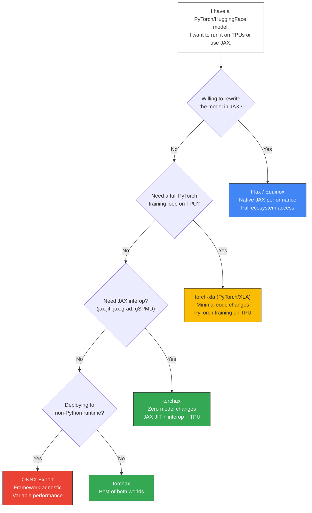

# Ecosystem Comparison Decision Tree

Render at https://mermaid.live or with `mmdc` CLI.



## Comparison Table

```
┌─────────────────────┬──────────┬─────────────┬──────────────────────────────┐
│ Approach            │ Effort   │ Performance │ Best For                      │
├─────────────────────┼──────────┼─────────────┼──────────────────────────────┤
│ Flax / Equinox      │ High     │ Native JAX  │ New projects in JAX           │
│ torch-xla           │ Low      │ Good (XLA)  │ PyTorch training on TPUs      │
│ torchax             │ Low      │ Great (JIT) │ HF models on JAX, interop     │
│ ONNX Export         │ Medium   │ Variable    │ Cross-framework deployment    │
└─────────────────────┴──────────┴─────────────┴──────────────────────────────┘

Key differentiator:
- torch-xla: Optimizes PyTorch training on XLA devices
- torchax:   Enables JAX-native features (jax.jit, jax.grad, gSPMD) for PyTorch models
```
