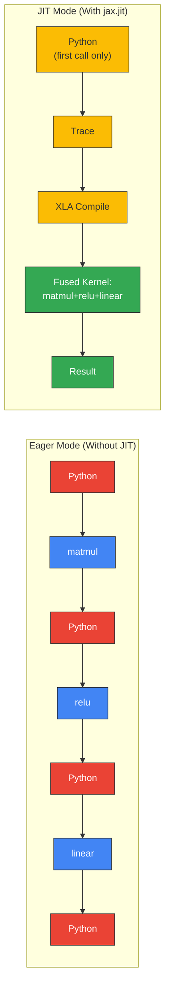

# JIT Compilation Flow Diagram

Render at https://mermaid.live or with `mmdc` CLI.



## Timeline Comparison

```
Eager Mode (every call):
┌──────┐ ┌────────┐ ┌──────┐ ┌──────┐ ┌──────┐ ┌────────┐ ┌──────┐
│Python│→│ matmul │→│Python│→│ relu │→│Python│→│ linear │→│Python│
└──────┘ └────────┘ └──────┘ └──────┘ └──────┘ └────────┘ └──────┘
←─────────────── ~500ms per call ──────────────────→

JIT Mode (first call):
┌──────┐ ┌───────┐ ┌─────────┐ ┌─────────────────────────┐
│Python│→│ Trace │→│ Compile │→│ Execute fused kernel    │
└──────┘ └───────┘ └─────────┘ └─────────────────────────┘
←────────── ~4000ms (one-time) ────────────────────→

JIT Mode (subsequent calls):
┌─────────────────────────┐
│ Execute fused kernel    │
└─────────────────────────┘
←──── ~5ms ────→
```
