# LoRA Architecture Diagram

Render at https://mermaid.live or with `mmdc` CLI.

```mermaid
graph TB
    subgraph "LoRA Weight Decomposition"
        X["Input x"]
        W["Frozen W<br/>(full rank d x d)"]
        LA["LoRA A<br/>(d → r)"]
        LB["LoRA B<br/>(r → d)"]
        S["Scale by alpha/r"]
        WO["W output"]
        LO["LoRA output"]
        ADD["Add outputs"]
        Y["Output y"]
    end

    subgraph "JittableModule Separation"
        JM["JittableModule(model)"]
        BUF["buffers<br/>Base weights W<br/>(not differentiated)"]
        PAR["params<br/>LoRA A, B matrices<br/>(jax.grad targets)"]
        GRAD["jax.value_and_grad"]
        GOUT["Gradients for<br/>A and B only"]
    end

    X --> W
    X --> LA
    W --> WO
    LA --> LB
    LB --> S
    S --> LO
    WO --> ADD
    LO --> ADD
    ADD --> Y

    JM --> BUF
    JM --> PAR
    PAR --> GRAD
    GRAD --> GOUT

    style X fill:#fff,stroke:#333,color:#333
    style W fill:#4285F4,stroke:#333,color:#fff
    style WO fill:#4285F4,stroke:#333,color:#fff
    style LA fill:#34A853,stroke:#333,color:#fff
    style LB fill:#34A853,stroke:#333,color:#fff
    style S fill:#34A853,stroke:#333,color:#fff
    style LO fill:#34A853,stroke:#333,color:#fff
    style ADD fill:#FBBC04,stroke:#333,color:#333
    style Y fill:#fff,stroke:#333,color:#333
    style JM fill:#FBBC04,stroke:#333,color:#333
    style BUF fill:#4285F4,stroke:#333,color:#fff
    style PAR fill:#34A853,stroke:#333,color:#fff
    style GRAD fill:#EA4335,stroke:#333,color:#fff
    style GOUT fill:#EA4335,stroke:#333,color:#fff
```



## Text Description

```
Part 1: LoRA Weight Decomposition
──────────────────────────────────

                    ┌───────────────────┐
                    │    Input x        │
                    └──┬────────────┬───┘
                       │            │
                       ▼            ▼
            ┌──────────────┐  ┌──────────┐
 (frozen)   │  W (d x d)   │  │  A (d→r) │  (trainable)
            └──────┬───────┘  └────┬─────┘
                   │               │
                   │               ▼
                   │          ┌──────────┐
                   │          │  B (r→d) │  (trainable)
                   │          └────┬─────┘
                   │               │
                   │               ▼
                   │          ┌──────────────┐
                   │          │ scale: a/r   │
                   │          └────┬─────────┘
                   ▼               ▼
            ┌─────────────────────────────┐
            │    Add: W*x + (a/r)*B*A*x   │
            └──────────────┬──────────────┘
                           ▼
                    ┌──────────────┐
                    │   Output y   │
                    └──────────────┘

Part 2: JittableModule Separation
─────────────────────────────────

    ┌─────────────────────────────────────────────┐
    │  JittableModule(model)                       │
    └──────────┬──────────────────┬───────────────┘
               │                  │
               ▼                  ▼
    ┌─────────────────┐  ┌─────────────────────┐
    │ buffers          │  │ params               │
    │ Base weights W   │  │ LoRA A, B matrices   │
    │ (frozen, no grad)│  │ (trainable)          │
    └─────────────────┘  └──────────┬────────────┘
                                    │
                                    ▼
                          ┌─────────────────────┐
                          │ jax.value_and_grad   │
                          │ computes gradients   │
                          │ for params only      │
                          └──────────┬──────────┘
                                    │
                                    ▼
                          ┌─────────────────────┐
                          │ Gradients for A, B   │
                          │ → optax updates only │
                          │   the LoRA weights   │
                          └─────────────────────┘
```
