# Tensor Parallelism Diagram

Render at https://mermaid.live or with `mmdc` CLI.

```mermaid
graph TB
    subgraph "Attention Block"
        I1["Input X<br/>(replicated)"]

        subgraph "Column-Parallel (1st matmul)"
            Q["Q_proj<br/>shard(axis, None)"]
            K["K_proj<br/>shard(axis, None)"]
            V["V_proj<br/>shard(axis, None)"]
        end

        ATT["Attention<br/>(data parallel — heads sharded)"]

        O["O_proj<br/>shard(None, axis)"]
        AR1["all-reduce (sum)"]
        OUT1["Output<br/>(replicated)"]
    end

    subgraph "FFN Block"
        I2["Input X<br/>(replicated)"]

        subgraph "Column-Parallel (1st matmul) "
            GATE["Gate_proj<br/>shard(axis, None)"]
            UP["Up_proj<br/>shard(axis, None)"]
        end

        MUL["element-wise multiply"]
        DOWN["Down_proj<br/>shard(None, axis)"]
        AR2["all-reduce (sum)"]
        OUT2["Output<br/>(replicated)"]
    end

    I1 --> Q & K & V
    Q & K & V --> ATT
    ATT --> O
    O --> AR1
    AR1 --> OUT1

    I2 --> GATE & UP
    GATE & UP --> MUL
    MUL --> DOWN
    DOWN --> AR2
    AR2 --> OUT2

    style Q fill:#4285F4,stroke:#333,color:#fff
    style K fill:#4285F4,stroke:#333,color:#fff
    style V fill:#4285F4,stroke:#333,color:#fff
    style GATE fill:#4285F4,stroke:#333,color:#fff
    style UP fill:#4285F4,stroke:#333,color:#fff
    style O fill:#34A853,stroke:#333,color:#fff
    style DOWN fill:#34A853,stroke:#333,color:#fff
    style AR1 fill:#EA4335,stroke:#333,color:#fff
    style AR2 fill:#EA4335,stroke:#333,color:#fff
```



## Weight Sharding Summary

```
Layer Type          Weight              Sharding         Reason
─────────────────────────────────────────────────────────────────
Attention Q_proj    (hidden, hidden)    (axis, None)     Column-parallel (1st matmul)
Attention K_proj    (hidden, hidden)    (axis, None)     Column-parallel (1st matmul)
Attention V_proj    (hidden, hidden)    (axis, None)     Column-parallel (1st matmul)
Attention O_proj    (hidden, hidden)    (None, axis)     Row-parallel (2nd matmul)
FFN Gate_proj       (ffn, hidden)       (axis, None)     Column-parallel (1st matmul)
FFN Up_proj         (ffn, hidden)       (axis, None)     Column-parallel (1st matmul)
FFN Down_proj       (hidden, ffn)       (None, axis)     Row-parallel (2nd matmul)
Embedding           (vocab, hidden)     (None, axis)     Row-parallel
LM Head             (vocab, hidden)     (None, axis)     Row-parallel
Layer Norms         (hidden,)           replicated       Small, no benefit from sharding

Key insight: Column-parallel → Row-parallel requires only ONE all-reduce per block.
```
