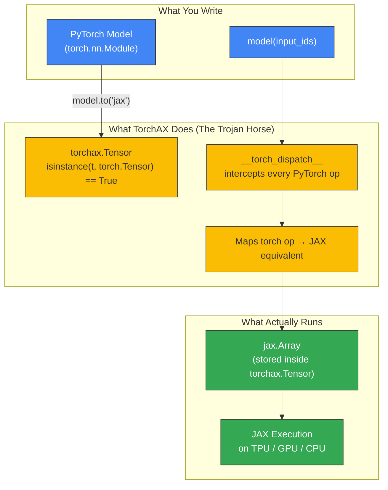

# TorchAX Architecture Diagram

Render at https://mermaid.live or with `mmdc` CLI.



## Text Description

```
┌─────────────────────────────────────────────────┐
│  Your Code (unchanged PyTorch)                   │
│                                                   │
│  model = AutoModelForCausalLM.from_pretrained()  │
│  model.to("jax")   ← only change                │
│  output = model(input_ids)                       │
└───────────────────────┬─────────────────────────┘
                        │
                        ▼
┌─────────────────────────────────────────────────┐
│  torchax Layer (The Trojan Horse)                │
│                                                   │
│  torchax.Tensor wraps jax.Array                  │
│  PyTorch sees: torch.Tensor ✓                    │
│  Actually contains: jax.Array                    │
│                                                   │
│  Every torch op → intercepted → JAX equivalent   │
└───────────────────────┬─────────────────────────┘
                        │
                        ▼
┌─────────────────────────────────────────────────┐
│  JAX Backend                                      │
│                                                   │
│  Eager mode: ops execute one at a time           │
│  JIT mode:   ops compiled + fused by XLA         │
│  Hardware:   TPU / GPU / CPU                     │
└─────────────────────────────────────────────────┘
```
