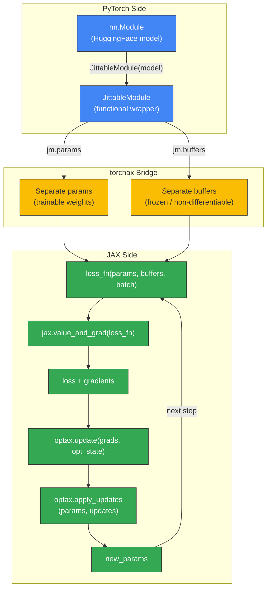

# Training Loop Flow Diagram

Render at https://mermaid.live or with `mmdc` CLI.



## Text Description

```
┌─────────────────────────────────────────────────┐
│  PyTorch Side                                    │
│                                                   │
│  nn.Module (HuggingFace model)                   │
│       │                                           │
│       ▼                                           │
│  JittableModule (functional wrapper)             │
└───────────┬───────────────┬─────────────────────┘
            │               │
            ▼               ▼
┌─────────────────────────────────────────────────┐
│  torchax Bridge                                   │
│                                                   │
│  params (trainable)    buffers (frozen)           │
└───────────┬───────────────┬─────────────────────┘
            │               │
            ▼               ▼
┌─────────────────────────────────────────────────┐
│  JAX Side (functional training loop)             │
│                                                   │
│  loss_fn(params, buffers, batch)                 │
│       │                                           │
│       ▼                                           │
│  jax.value_and_grad(loss_fn)                     │
│       │                                           │
│       ▼                                           │
│  loss + gradients                                │
│       │                                           │
│       ▼                                           │
│  optax.update(grads, opt_state) → updates        │
│       │                                           │
│       ▼                                           │
│  optax.apply_updates(params, updates)            │
│       │                                           │
│       ▼                                           │
│  new_params ──────────────────────→ (loop back)  │
└─────────────────────────────────────────────────┘
```
