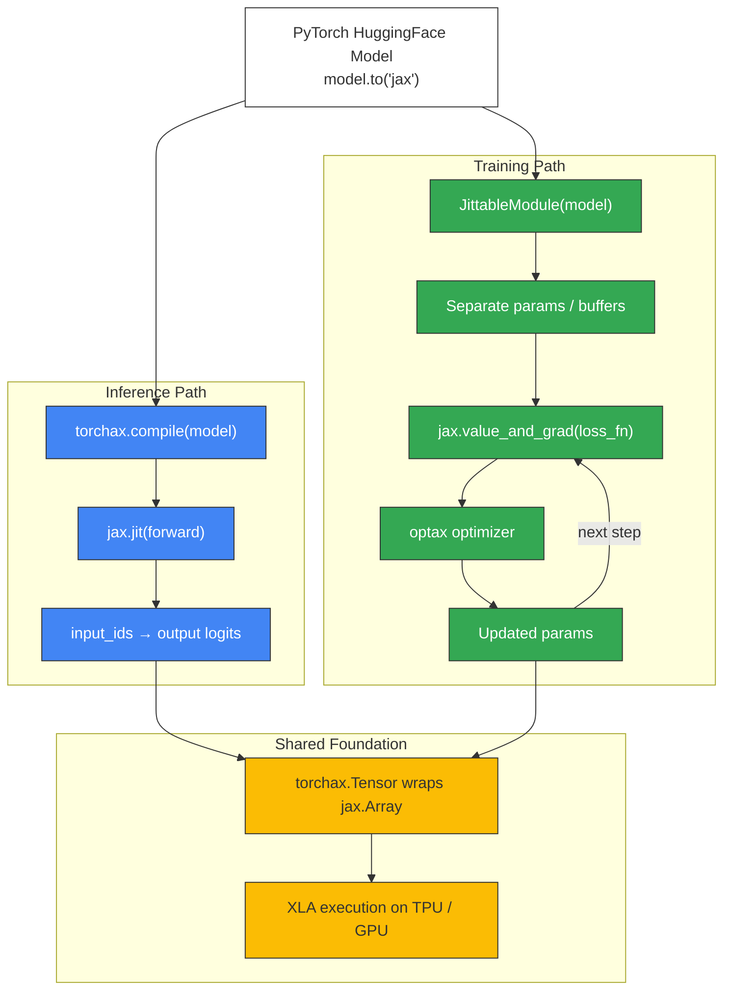

# Training vs Inference Comparison Diagram

Render at https://mermaid.live or with `mmdc` CLI.



## Text Description

```
                  ┌──────────────────────────────┐
                  │  PyTorch HuggingFace Model    │
                  │  model.to("jax")              │
                  └──────────┬─────────┬──────────┘
                             │         │
              ┌──────────────┘         └──────────────┐
              ▼                                       ▼
┌──────────────────────────────┐  ┌──────────────────────────────┐
│  Inference Path               │  │  Training Path                │
│                               │  │                               │
│  torchax.compile(model)      │  │  JittableModule(model)        │
│       │                       │  │       │                       │
│       ▼                       │  │       ▼                       │
│  jax.jit(forward)            │  │  Separate params / buffers    │
│       │                       │  │       │                       │
│       ▼                       │  │       ▼                       │
│  input → output logits       │  │  jax.value_and_grad(loss_fn)  │
│                               │  │       │                       │
│                               │  │       ▼                       │
│                               │  │  optax optimizer              │
│                               │  │       │                       │
│                               │  │       ▼                       │
│                               │  │  updated params ─→ (loop)    │
└──────────────┬───────────────┘  └──────────────┬───────────────┘
               │                                  │
               └──────────────┬───────────────────┘
                              ▼
┌─────────────────────────────────────────────────────────────────┐
│  Shared Foundation                                               │
│                                                                   │
│  torchax.Tensor wraps jax.Array                                  │
│  Both paths use the same dispatch mechanism:                     │
│    torch op → __torch_dispatch__ → JAX equivalent                │
│  XLA execution on TPU / GPU / CPU                                │
└─────────────────────────────────────────────────────────────────┘
```
